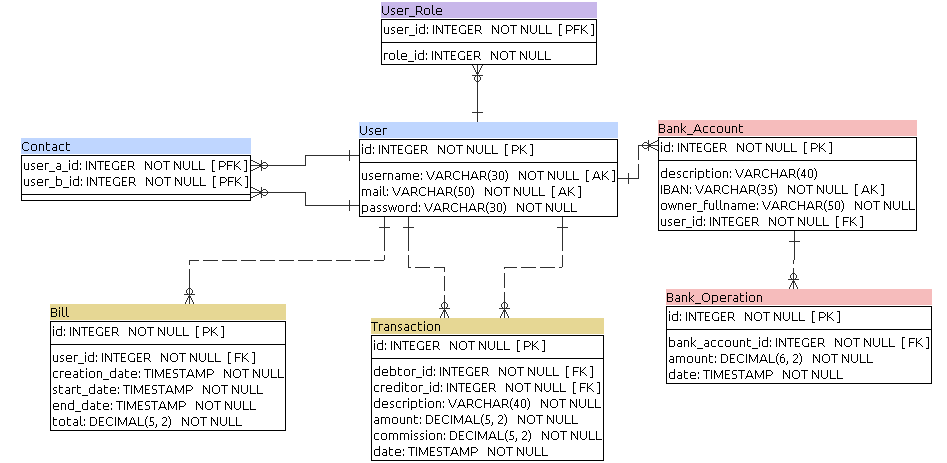

# README
Documentation for PayMyBuddy 'PayApp' Application .

### Build
Build application with command `mvn clean package` or `mvn clean verify`
to include integration tests.

**NOTE :** In that second case, the server-side application will start during build. 
To kill the process, retrieve Spring PID in logs and kill it manually.

_This is in-progress work, a fix will eventually be added._

### Login to application
##### Super user
You can use user with username '**thibaut.beylard@example.com**' and password
'**adminpass**' to connect as a super user with 'ADMIN' authorizations. 

##### Client API
Go to endpoint `/swagger-ui.html` to check all available endpoints for the application.

### Site
Build application including `mvn site:stage` goal to generated Maven sites for whole project. 
Relevant informations will essentially be in payapp-server site where you'll find test reports.

### Appendices

##### UML Diagram

##### Database Model

NOTE : This Model was generated with _SQL Power Architect_. Due to its limitations, `DATETIME` datatype is represented by `TIMESTAMP`.